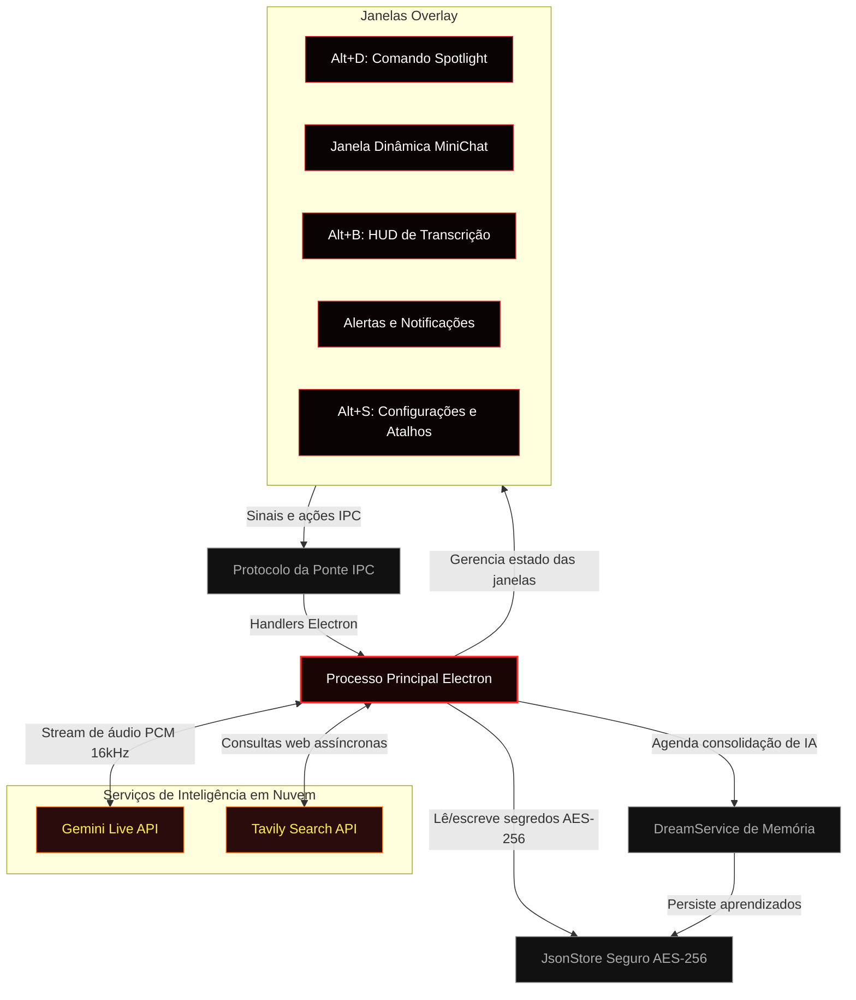

<p align="center">
  
</p>

<table>
  <tr>
    <td width="35%" align="center" valign="top">
      
      <p align="center" style="margin-top: 10px; margin-bottom: 0;">
        
        
        
      </p>
    </td>
    <td width="65%" valign="top" style="padding-left: 20px;">
      <h1 style="margin-top: 0; margin-bottom: 8px;">Hades Agent </h1>
      <p><strong>Hades é um companheiro desktop invisível e ultrarrápido, com consolidação autônoma de memória em segundo plano e agendador local de tarefas.</strong></p>
      <p><strong>Limites de segurança:</strong> isolado em sandbox, com <strong>zero acesso de escrita no sistema</strong> para a IA (não cria, edita ou apaga arquivos, nem executa scripts). A IA fica restrita a consultas Google em tempo real via Tavily e logs locais de memória, mantendo o computador seguro.</p>
    </td>
  </tr>
</table>

<p align="center" style="margin-top: 20px;">
  <a href="https://github.com/victorl-dev/Hades-Agent/releases"></a>
  <a href="https://github.com/victorl-dev/Hades-Agent/blob/master/LICENSE"></a>
  <a href="https://github.com/victorl-dev/Hades-Agent"></a>
  <a href="https://github.com/victorl-dev/Hades-Agent"></a>
</p>

<table>
<tr>
  <td><b>🛡️ Escudo Anti-Gravação</b></td>
  <td>Proteção nativa do sistema operacional via <code>setContentProtection</code>. No Windows, o Hades pode ficar invisível para APIs de captura de tela como OBS Studio, Discord, Teams e Zoom, reduzindo vazamento de dados privados em compartilhamento de tela.</td>
</tr>
<tr>
  <td><b>🎙️ Transcrição em Tempo Real (Alt+B)</b></td>
  <td>Pressione <code>Alt+B</code> para capturar e transcrever áudio interno do PC, como reuniões ou aulas, em tempo real. O fluxo envia áudio <strong>PCM 16 kHz</strong> por WebSocket full-duplex diretamente para a <strong>Gemini Live API</strong>.</td>
</tr>
<tr>
  <td><b>⚡ Barra de Comando Spotlight</b></td>
  <td>Pressione <code>Alt+D</code> para abrir uma barra de comando flutuante e sem borda. Ela entrega respostas com contexto de internet em tempo real via Tavily Search API, permite anexar imagens, trocar modelos e responder sem sair do fluxo de trabalho.</td>
</tr>
<tr>
  <td><b>💬 MiniChat de Sessão</b></td>
  <td>HUD persistente de conversa que mostra modelo ativo, contagem de tokens e custo da sessão. A sessão pode ser encerrada para zerar timers, histórico e gastos sem reiniciar o app.</td>
</tr>
<tr>
  <td><b>🧠 Consolidação de Memória Dream</b></td>
  <td>Ciclos agendados em segundo plano sintetizam logs recentes de sessão em um perfil comprimido de memória em <strong><code>learnings.json</code></strong>, semelhante à consolidação de memória de longo prazo durante o sono.</td>
</tr>
<tr>
  <td><b>📋 Agendador Seguro de Tarefas</b></td>
  <td>Livro local de tarefas em sandbox, sem permissão ampla de escrita no sistema. Permite agendar pesquisas web, criar lembretes diários e organizar respostas do MiniChat sem modificar arquivos locais arbitrariamente.</td>
</tr>
</table>

---

##  Começando

### Para Usuários (Instalador)

1. Acesse a página de **[Releases](https://github.com/victorl-dev/Hades-Agent/releases)**.
2. Baixe **`Hades-Agent-Setup-1.0.0.exe`** ou a versão portátil `.zip`.
3. Execute o instalador, abra o Hades e pressione **`Alt+S`** para informar suas chaves de API.

> [!WARNING]
> **Plataforma:** Hades é Windows-first. O suporte Linux é experimental e baseado em capacidades: os fluxos centrais de chat rodam depois da refatoração Linux, mas stealth/content protection e captura de áudio do sistema não são garantidos. macOS não é suportado.

> [!IMPORTANT]
> Hades requer duas chaves de API gratuitas para operar:
> - **[Google Gemini API Key](https://aistudio.google.com/app/apikey)** - para inferência de IA e streaming de voz.
> - **[Tavily Search API Key](https://app.tavily.com/)** - para busca web em tempo real.

### Para Desenvolvedores (Build do Código-Fonte)

**Pré-requisitos**

| Requisito | Versão | Observações |
| :--- | :--- | :--- |
| [Node.js](https://nodejs.org/) | v18.x ou mais novo | LTS recomendado |
| npm | incluído com Node.js | — |
| Windows | 10 / 11 | alvo principal |
| Linux | distribuição desktop moderna | suporte experimental via scripts Linux |

```bash
# 1. Clone o repositório
git clone https://github.com/victorl-dev/Hades-Agent.git
cd Hades-Agent

# 2. Instale as dependências
npm install

# 3. Execute o ambiente de desenvolvimento no Windows
npm run dev

# 4. No Linux, use o script específico
npm run dev:linux
```

O servidor de desenvolvimento inicia o Vite na porta `3000` e o Electron com hot reload do renderer.

---

##  Atalhos de Teclado

O Hades fica silencioso na bandeja do sistema e pode ser chamado de qualquer aplicação:

| Atalho | Ação |
| :--- | :--- |
| **`Alt+D`** | Abrir ou ocultar a barra de comando Spotlight |
| **`Alt+B`** | Abrir ou ocultar o HUD de transcrição em tempo real |
| **`Alt+S`** | Abrir configurações e customização de atalhos |
| **`Alt+V`** | Alternar modo de entrada por voz |
| **`Esc`** | Ocultar a janela ativa e restaurar o foco anterior |

> [!TIP]
> Todos os atalhos podem ser redefinidos. Abra a aba **Atalhos** em Configurações (`Alt+S`) para escolher novas combinações.

---

##  Arquitetura do Sistema

Hades coordena múltiplas janelas overlay por uma ponte estrita de eventos IPC, mantendo o renderer em sandbox enquanto o processo principal executa operações privilegiadas:



---

##  Engenharia Assistida por IA

O Hades foi co-desenvolvido com apoio de agentes de programação, usando desenvolvimento orientado por subagentes e validação incremental:

- **Autonomia modular:** partes como IPC, criptografia AES-256, pipeline PCM de voz e ciclo de vida de janelas foram isoladas por responsabilidade.
- **Gates de qualidade:** a arquitetura favorece hooks menores, store central (`jsonStore.js`) e build Vite rápido.
- **Hardening contínuo:** isolamento de sandbox, Content Security Policy e `contextIsolation` protegem as fronteiras IPC.

---

##  Inspiração e Créditos

> [!NOTE]
> Hades Agent é inspirado por **Persua**, um conceito de assistente de voz e IA em tempo real criado pelo engenheiro de software **Lucas Montano** ([@lucasmontano](https://github.com/lucasmontano)). O Hades foi desenvolvido do zero para explorar streaming PCM, WebSockets full-duplex e proteção de conteúdo em nível de sistema operacional no Electron.

---

##  Histórico de Stars

<a href="https://www.star-history.com/?repos=victorl-dev%2Fhades-agent&type=date&legend=top-left">
 <picture>
   <source media="(prefers-color-scheme: dark)" srcset="https://api.star-history.com/chart?repos=victorl-dev/hades-agent&type=date&theme=dark&legend=top-left" />
   <source media="(prefers-color-scheme: light)" srcset="https://api.star-history.com/chart?repos=victorl-dev/hades-agent&type=date&legend=top-left" />
   
 </picture>
</a>

---

##  Licença

MIT — consulte [LICENSE](LICENSE).

Construído por [Victor L.](https://github.com/victorl-dev)
